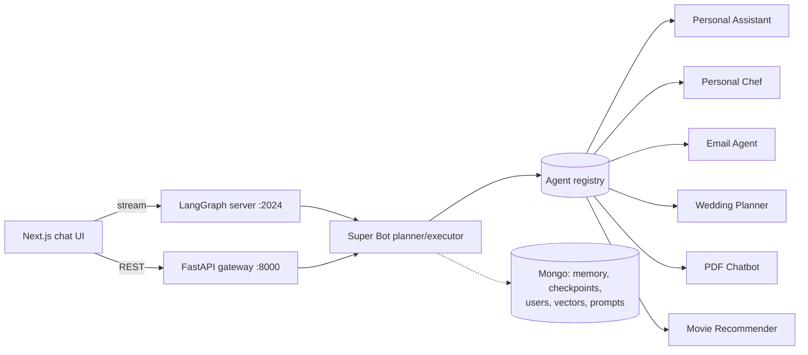
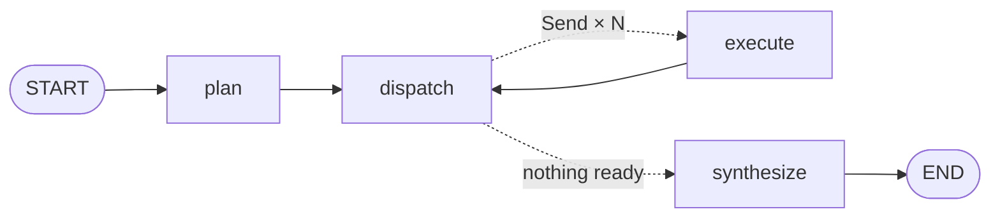

# SuperBot — Architecture

Written to be read once, top to bottom, and then defended in a design review.
Every section answers *why this and not the obvious alternative*.

---

## 1. What this is

A multi-agent platform. A user asks for something; the platform decides which
specialist agents are involved, runs them — in parallel when it can — and
returns one answer. Agents are independent, self-describing units; nothing in
the orchestration layer hardcodes what agents exist.



**Two runtimes, one set of graphs.** The LangGraph server hosts the graphs for
token streaming and human-in-the-loop; the FastAPI gateway owns auth, uploads,
and simple request/response calls. Both import the *same* compiled graphs. This
duality is load-bearing and explains several decisions below.

---

## 2. Module map

| Module | Responsibility | Depends on |
|---|---|---|
| `core/registry.py` | Which agents exist; capability lookup | `core/base_agent.py` |
| `core/base_agent.py` | The agent contract (`AgentManifest`) | — |
| `core/store.py` | `BaseStore` over MongoDB | pymongo |
| `core/memory.py` | Shared long-term memory + agent middleware | `core/store.py` |
| `core/approval.py` | Declarative HITL gating for destructive tools | langchain |
| `core/concurrency.py` | One run at a time per `thread_id` | — |
| `core/telemetry.py` | Per-run tokens, latency, cost | `core/db.py` |
| `tools/email/` | Provider-agnostic mailbox (`base`/`mock`/`gmail`) | — |
| `tools/weather/` | Provider-agnostic weather (`base`/`openmeteo`) | httpx |
| `tools/todo/` | Provider-agnostic tasks (`base`/`internal`/`memory`) | `core/db.py` |
| `core/prompts.py` | Prompts from Mongo, versioned, with code fallback | `core/db.py` |
| `llm/factory.py` | Provider abstraction (`get_chat_model`) | — |
| `tools/mcp.py` | MCP servers from config, with retry | — |
| `superbot/state.py` | State schema, reducers, **every bound** | — |
| `superbot/planner.py` | Request → validated task DAG | `registry`, `llm` |
| `superbot/executor.py` | Schedule, run, merge | `registry` |
| `superbot/graph.py` | Topology assembly only — no logic | the three above |
| `agents/*.py` | One agent each; exports `agent` + `MANIFEST` | `llm`, `core/memory` |

**The rule that keeps this navigable:** dependencies point *inward*, toward
`core/`. An agent may import `core`; `core` never imports an agent. The registry
breaks the would-be cycle by importing agent modules dynamically by string.

---

## 3. Orchestration

### 3.1 Why a planner and not an agent

The instinct for "coordinate several specialists" is a ReAct agent with the
agents as tools. Rejected: an agent loop is unbounded by construction, and the
failure mode (fifteen tool calls to answer a recipe question) is expensive and
hard to explain to a user.

The ladder — **chain → router → planner → agent → supervisor** — says take the
lowest rung that expresses the problem.

- A **router** (what v1 was) picks one agent. It cannot answer *"find flights to
  Goa and email the shortlist to Priya"* — that is two agents.
- A **planner** emits a *fixed, inspectable* task DAG up front, then executes it.
  Bounded, and the plan is a data structure you can log, show, and assert on.
- A full **agent** would let the model re-decide after every step. We do not need
  that: the agent set is small and the dependency structure of a request is
  usually obvious from the request itself.

So: planner–executor. One LLM call to plan, then deterministic scheduling.

### 3.2 The graph



| Node | Does | LLM calls |
|---|---|---|
| `plan` | Request → validated `Task` DAG | 1 (0 if an agent is manually selected) |
| `dispatch` | Advance the layer counter | 0 |
| `fan_out` (edge) | Compute the ready set; `Send` one worker per task | 0 |
| `execute` | Run one task on one agent | agent-dependent |
| `synthesize` | Merge results into one answer | 1 (**0** when the plan had one task) |

`dispatch` exists only to increment the counter, because a conditional edge
chooses destinations but cannot write state. `fan_out` does the real routing.

### 3.3 Why `Send`, and what that forces

`Send` fans out to N workers where N is unknown until runtime, and hands each
worker a **private payload** that need not match the parent schema. Workers
therefore never see each other's state.

The consequence you cannot avoid: **several workers write `results` in the same
superstep, so `results` must have a reducer.**

```python
results: Annotated[list[TaskResult], operator.add]
```

Without it LangGraph raises `InvalidUpdateError` rather than guessing whose
write wins. This is the single most common parallel-execution bug in LangGraph
and the reason `state.py` exists as its own module.

### 3.4 Scheduling by layers

`_ready()` returns tasks whose dependencies have all *succeeded* and whose retry
budget is unspent. Everything ready runs concurrently; then `dispatch` recomputes.
A diamond (`t1`, `t2` → `t3`) is two layers, not three tasks in sequence.

A task blocked behind a permanently failed dependency simply never becomes
ready, so `_ready` empties and the run proceeds to `synthesize`. **Deadlock is
expressed as termination**, not as a hang.

### 3.5 Untrusted plans

The planner's output is model-generated, so `_validate()` — not the model —
decides what runs:

- unknown `agent_id` → dropped (validated against the registry)
- duplicate ids → dropped
- blank instructions → dropped
- more than `MAX_TASKS` → truncated
- **dependencies may only point backwards**

That last rule is the elegant one: it kills forward references and makes cycles
*unrepresentable*, so the scheduler cannot deadlock on a malformed plan. No cycle
detection algorithm required.

### 3.6 The supervisor's own voice

`ASSISTANT_AGENT_ID` ("assistant") is a task destination that is *not* a registry
agent: no module, no tools, never in the agent dropdown — it **is** the Super
Bot, answering with its own persona (`superbot_assistant_system`). Without it,
every turn had to be forced onto a domain specialist, so "who are you?" fell to
the default agent and the platform introduced itself as a personal chef.

### 3.7 Routing across turns

The supervisor is stateless per turn by design, which loses conversations: a
follow-up like *"what about the budget?"* carries no clue about which agent
answered the question it follows. So `plan` reads `routed_to` — still holding the
previous turn's agents, because this node is what overwrites it — and passes it
to the planner as a **tie-breaker, not a lock-in**: same subject stays with the
same agent, a changed subject switches immediately.

The counterpart is turn *isolation*. Thread state outlives the turn while task
ids restart at `t1`, so `results` uses a reducer that a `None` write resets
(`accumulate_results`), and `plan` writes that `None` on every turn. Plain
`operator.add` left last turn's `t1` marked succeeded: nothing became ready,
nothing dispatched, and `synthesize` replayed the previous answer — a bot that
looked like it had stopped listening.

---

## 4. Memory

Two orthogonal axes. Most assistants need both; they are not alternatives.

| | Within one conversation | Across conversations |
|---|---|---|
| Mechanism | **Checkpointer** | **Store** |
| Keyed by | `thread_id` | `("memories", user_id)` |
| Holds | Messages, working state | Durable facts about the user |
| Implementation | `MongoDBSaver` | `core/store.py` |

### 4.1 Why a hand-written Store

LangGraph ships `InMemoryStore` (lost on restart) and `PostgresStore`. There is
no first-party Mongo store. The platform already runs **one** Atlas cluster —
users, PDF vectors, checkpoints, prompts. Adding Postgres for memory alone would
mean a second datastore to operate, back up, and secure.

`MongoDBStore` implements `BaseStore`, so it is not a bespoke repository: it can
be passed to `builder.compile(store=...)` or swapped for `PostgresStore` without
touching a caller.

**Data model.** One document per item. `path` is the namespace joined by `\x1f`,
which makes a prefix search an indexed, anchored regex — and makes
`("memories", "user-4")` correctly *not* match `("memories", "user-42")`.

### 4.2 Three deliberate subtractions

**No embeddings.** Under a few dozen memories per user, loading them all beats
semantic search: no recall failure mode, no embedding cost, no index to warm.
`MAX_MEMORIES_PER_USER = 40` keeps that assumption true. The seam is marked in
`core/store.py` for when it stops being.

**No profile document.** A profile's advantage over a collection is "one read, no
retrieval" — but we already read everything each turn, so it would be a second
schema over the same data plus a read-modify-write merge that silently drops
fields. Collection only.

**No background extraction pipeline.** Writes are model-gated: the model calls
`remember` when it learns something. We pay extraction cost only when there is
something to extract, and the decision appears in the trace as a tool call
instead of hiding in a queue.

### 4.3 Why a module-level store instead of `runtime.store`

Section 1's duality. On the gateway we compile the graphs, so we choose the
store. On the LangGraph dev server *it* compiles them and injects its own, which
is in-memory locally. Reading `runtime.store` would give durable memory on one
path and amnesia on the other. Owning the store in `core/memory.py` makes both
paths identical.

### 4.4 Security

> The namespace is derived **only** from authenticated identity — `configurable.owner`
> (gateway, from the JWT) or `langgraph_auth_user.identity` (dev server). Never
> from graph state, never from model output.

Whoever controls the namespace controls whose memories are read, so a
model-influenced namespace is a cross-account data leak reachable by prompt
injection. With no authenticated user, memory is **disabled** — not pooled into a
shared anonymous bucket. `tests/test_memory.py` asserts this directly.

Retrieved memories are **untrusted input**: they are user-authored text
re-entering a prompt, so a stored `"ignore previous instructions"` is a stored
prompt injection. `_memory_block()` fences them in `<user_memory>` and labels
them as data.

Users can list and delete their memories (`GET`/`DELETE /memories`). Deletion is
real, not a soft flag.

---

## 5. Approvals and the email agent

### 5.1 Risk is declared on the tool, not in the agent

Approval used to be a hand-maintained map inside the agent
(`interrupt_on={"send_email": True, ...}`). That put the safety property in the
wiring rather than on the dangerous thing, so it had to be edited every time a
tool was added — and failed *open* when someone forgot.

Now a tool declares itself:

```python
@requires_approval(describe=lambda a: f"Send an email\n\nTo: {a['to']}\n...")
@tool
async def send_email(to: str, subject: str, body: str, runtime: ToolRuntime) -> str:
```

and the agent asks for a policy over whatever tools it has:
`approval_middleware(TOOLS)`. Add a destructive tool later and it is gated
automatically. Nothing is marked by default, so forgetting to *unmark*
something costs an extra prompt, not an unwanted send.

`describe` matters more than it looks: an approval prompt showing the full
proposed email is reviewable; a raw JSON blob trains people to click approve.
Read-only tools are never gated — approval fatigue is a real failure mode.

Built on LangChain's `HumanInTheLoopMiddleware`, not a replacement for it: the
interrupt/resume mechanics stay upstream, and this layer only decides *which*
tools are gated and how the request reads.

### 5.2 Provider abstraction

The agent knows only `EmailProvider` (`tools/email/base.py`). Ids are opaque
strings, expected failures raise `EmailError` and reach the model as recoverable
text, and methods are synchronous because every real client library is.

`MockEmailProvider` is the default and is a *real mailbox* — sending appends to
Sent, archiving removes from the inbox but stays searchable, replying threads
onto the original. That is what makes the agent testable without credentials;
the previous `check_inbox()` returned a string literal, so no tool could observe
any other tool's effect and "it works" was unfalsifiable.

Mailboxes are cached per authenticated user, for the same reason memory
namespaces are: one shared instance would show one user another's mail.

**In-chat authentication was deleted.** The agent used to ask for an email and
password and compare them to a dataclass holding `password = "password123"`.
The platform already authenticates users, so a second weaker login was redundant
*and* taught users to type credentials into a chat box.

---

## 5b. What the UI shows

The chat renders **no tool calls and no tool results**. An agent chat that
prints every tool invocation reads like a debug log, and the raw JSON is not
what a user is there for. The full step-by-step trace goes to LangSmith, which
is the right place for it.

What replaces it is the **execution graph**: the plan, rendered as layers, with
live per-task status. Tasks in the same row ran at the same time. It only
appears for plans of two or more tasks — for a single-agent request there is
nothing to show that the answer does not already say.

One exception: a tool message carrying an **approval interrupt** still renders,
or human-in-the-loop would become unresumable from the UI.

### Streaming policy

`streamMode: ["values", "messages"]`. `values` alone delivers one state
snapshot per superstep, so the answer arrives in blocks; adding `messages`
streams tokens.

That raises a question a single-agent app never has to answer: *whose* tokens?
Three model calls can be in flight in one run.

| Call | Streams? | Why |
|---|---|---|
| Planner | No | Emits structured JSON — would spray a half-built object into the chat |
| Router (fallback) | No | Same |
| Agent, single-task plan | **Yes** | Synthesis is skipped, so these tokens *are* the answer |
| Agent, multi-task plan | No | Two agents at once would interleave two half-written answers |
| `synthesize` | **Yes** | The merged final answer |

Suppression uses the `langsmith:nostream` tag, decided per run from the
`solo` flag in the `Send` payload. It hides tokens from the *UI only* —
LangSmith still records every call.

---

## 6. Request lifecycle

`POST /chat` — *"Recommend a sci-fi film and a dinner with chicken and rice"*

1. **Auth** — JWT → user document; `thread_id` namespaced `{user_id}:{thread}`.
2. **Graph** — no `agent_id`, so the Super Bot graph, compiled with `MongoDBSaver`.
3. **`plan`** — one LLM call over the registry catalog → two tasks, no dependencies.
4. **`dispatch` → `fan_out`** — both ready → two `Send`s in one superstep.
5. **`execute` ×2, concurrently** — each loads that user's memories into its system
   prompt, runs, returns a `TaskResult`; results merge through the reducer.
6. **`dispatch`** — nothing ready → `synthesize`.
7. **`synthesize`** — one LLM call merges both into a single reply.

Measured end to end: ~25s, `layers=2` (one execution round plus the round that
found nothing left). A single-agent request skips steps 3 and 7's cost: ~7s.

---

## 7. Guardrails

Every one exists because the alternative is unbounded.

| Bound | Value | Prevents |
|---|---|---|
| `MAX_TASKS` | 6 | Fan-out width → cost per turn |
| `MAX_LAYERS` | 5 | DAG depth → the dispatch/execute loop spinning |
| `TASK_MAX_ATTEMPTS` | 2 | Retry storms on a failing agent |
| `CONTEXT_MESSAGES` | 6 | N workers × full history in `Send` payloads |
| `MAX_MEMORIES_PER_USER` | 40 | Prompt growth; keeps "load them all" honest |
| `MEMORIES_IN_PROMPT` | 20 | Per-call prompt size |

**Failure policy:** a worker never raises into the graph. A failed task is
recorded (`ok=False`), retried within budget, and reported honestly in the final
answer. One dead agent degrades the answer; it does not abort the fan-out.
Likewise, planning failure falls back to the single-agent classifier, and
synthesis failure returns the raw task results rather than losing completed work.

---

## 8. Decision log

| Decision | Chosen | Rejected | Would revisit if |
|---|---|---|---|
| Orchestration | Planner → bounded DAG | ReAct agent-of-agents | Requests needed to adapt mid-run |
| Replanning | None | Replan-on-failure loop | Plans measurably went stale |
| Capability routing | Planner emits `agent_id` | Capability → agent resolver | Two agents shared a capability |
| General chat | Reserved `assistant` id | A registered general agent | It needed tools or its own memory |
| Turn continuity | Previous `routed_to` as a hint | Pinning the thread to an agent | Users wanted an explicit "stay here" |
| Memory schema | Collection | Profile, or both | Facts became bounded and structured |
| Retrieval | Load all | Vector search | > ~50 memories/user |
| Store backend | Mongo `BaseStore` | `PostgresStore` | Postgres entered the stack anyway |
| Memory writes | Model-gated tool | Always-extract; background job | Extraction quality dropped |
| Store access | Module singleton | `runtime.store` | Both runtimes compiled the graphs |
| Test doubles | `mongomock` | Testcontainers | The suite needed index/TTL fidelity |

---

## 9. Known gaps

Stated plainly, because the interesting question is always what you *didn't* do.

1. **Nested HITL.** The Email Agent's send-approval works when that agent is
   selected directly. An `interrupt()` inside a fanned-out worker propagates to
   the *parent* Super Bot run, so resuming targets the parent thread. This
   predates v2 and is part of the email refactor.
2. **The Gmail provider is a stub.** `tools/email/gmail.py` documents exactly
   what to build and fails loudly; the mock provider is the working default.
   Shipping untested Gmail API calls would be worse than an honest gap.
3. **No evaluator.** Nothing critiques a task result before it reaches the user.
   The hook is `synthesize`; the cost is latency, so it should be conditional on
   low confidence rather than run every turn.
4. **Cost rates are unset by default.** `core/telemetry.py` records tokens and
   latency for every run, but computes cost only for models listed in
   `MODEL_PRICING` — rates vary by provider, region and contract, so shipping
   defaults would produce confidently wrong numbers.
5. **Run concurrency is guarded per process only.** `core/concurrency.py`
   serialises runs on a `thread_id` within one gateway worker; multiple workers
   or replicas would need a shared lock. Only `reject` and `enqueue` are
   implemented — `interrupt` and `rollback` need in-flight cancellation.
6. **Store integration tests use `mongomock`**, which does not model TTL reaping
   or unique-index enforcement. Both were verified by hand against Atlas 8.0
   (unique `(path, key)` rejects duplicates; the TTL index on `expires_at` is
   created and stamped) but nothing in CI covers them.
