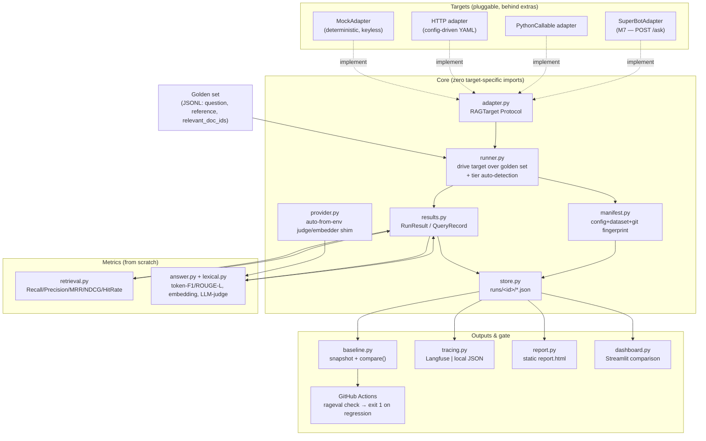
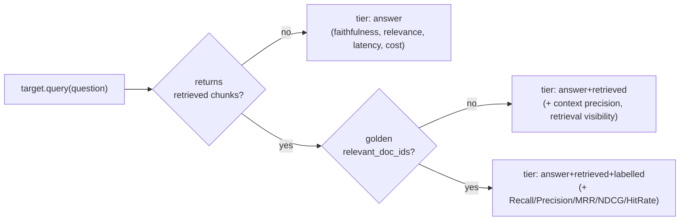

# rageval architecture

`rageval` is a **portable RAG evaluation harness** — a reusable "USB port" that measures
retrieval + answer quality and gates regressions in CI, talking to *any* RAG system through
one small adapter interface. The single rule the whole design serves:

> **The core imports nothing target-specific.** Adapters depend on the core; the core never
> depends on an adapter. That's what makes the harness `pip install`-able against any target
> and runnable end-to-end with **zero API keys** (via the deterministic MockAdapter).

## Data flow

## Why the pieces are split this way

| Component | Job | Design constraint it honors |
| --- | --- | --- |
| `core/adapter.py` | The contract every target implements (`query`, optional `retrieve`) | Core has no target imports — the seam that makes the harness portable |
| `runner.py` | Drives a target over the golden set, times it, detects the tier | Stays **metric-agnostic**: it produces a run, metrics read it afterward |
| `metrics/` | Retrieval + answer scores, implemented from first principles | Runs keyless on lexical + retrieval; judge/embedding tiers are additive |
| `core/provider.py` | Auto-from-env judge/embedder shim | Returns `None` without a key, so Mock/CI never need secrets |
| `core/manifest.py` | Config + dataset + git fingerprint per run | Makes every run reproducible and comparisons **refusable** when unfair |
| `core/baseline.py` | Snapshot a blessed run, `compare()` later runs | Only `[0,1]` quality metrics gate; different dataset → incomparable |
| `core/tracing.py` | Observability behind a `Tracer` Protocol | A tracing outage can **never** break a run's numbers |
| `report.py` / `dashboard.py` | Human-legible outputs (static HTML / interactive) | Report is pure-stdlib core; the dashboard lives behind an extra |

## The evaluation tiers

The runner adapts to whatever a target can return and records which tier ran — it never
fails because a richer tier's inputs are absent.

## Portability check (enforced)

- `python -c "import rageval.core.adapter"` works with **no** target/host-app deps installed.
- Every optional capability (HTTP targets, tracing, dashboard, SuperBot) is a declared
  **extra**, lazily imported — so the base install stays tiny and the MockAdapter path is
  fully offline.
- CI runs lint + type-check + tests + the regression gate on every push with **no secrets**.
